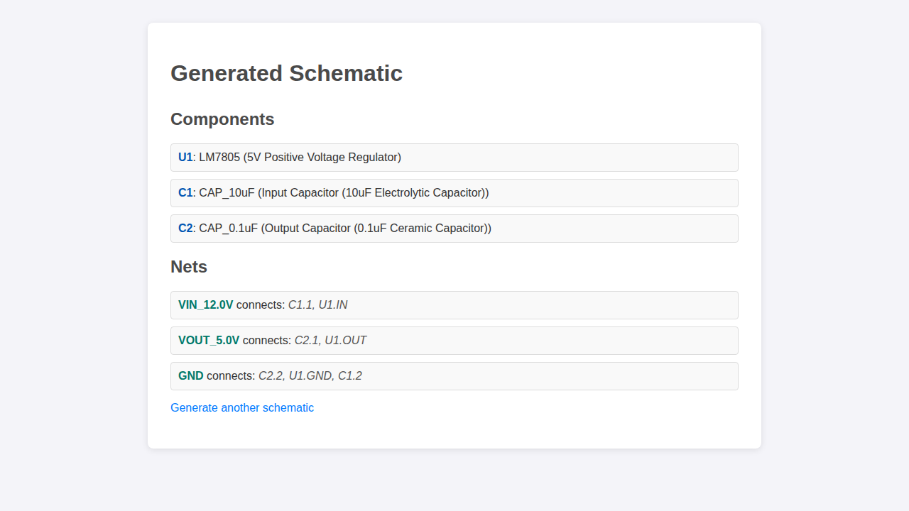
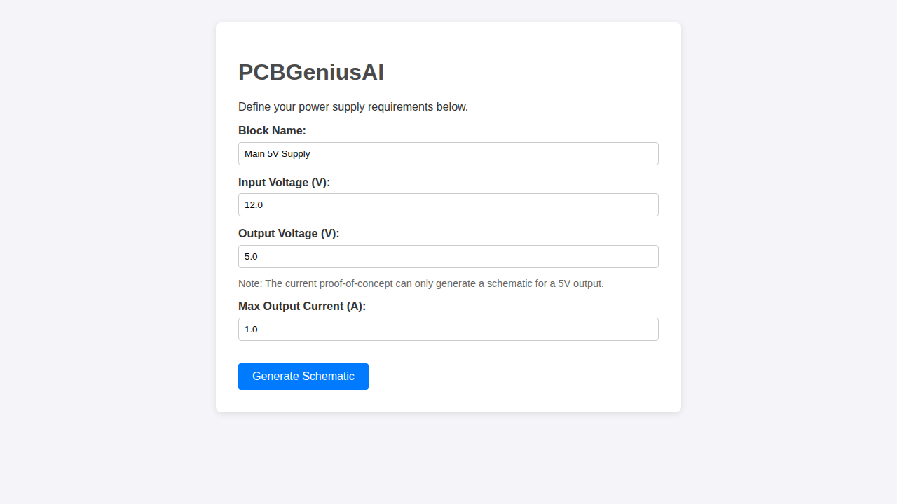

# PCBGeniusAI: Your AI Co-pilot for PCB Design

<p align="center">
  
</p>

**PCBGeniusAI** is an ambitious, open-source project to create a revolutionary, AI-powered software suite that automates and optimizes the entire Printed Circuit Board (PCB) design workflow. Imagine an intelligent assistant that understands your requirements, generates schematics, lays out your board, and even prepares the documentation for you.

Our mission is to empower electronic engineers, hardware startups, hobbyists, and academic institutions by making PCB design faster, smarter, and more accessible.

## 🌟 Vision

We envision an **AI co-pilot** that works alongside the designer. You are always in control, but the AI handles the tedious, repetitive, and complex tasks. From interpreting a high-level description of a circuit to suggesting optimal component placements and routing strategies, PCBGeniusAI aims to be an indispensable partner in hardware creation.

## ✨ Key Features

Our development is guided by a feature-rich roadmap that will be rolled out incrementally.

### 1. Web-Based Requirements Input
A simple and intuitive web interface allows you to define the requirements for your circuit, starting with power supplies.

<p align="center">
  
  <br>
  <em>The current web UI for requirements input.</em>
</p>

### 2. AI-Powered Schematic Generation
The system automatically selects components and generates a schematic based on your input. The proof-of-concept can currently generate a 5V power supply circuit.

<p align="center">
  
  <br>
  <em>A schematic generated by the system.</em>
</p>

### 3. Intelligent PCB Layout Automation (Future)
Our AI will suggest optimal component placements and automatically route the PCB, adhering to design rules and optimizing for signal integrity, thermal performance, and manufacturability.

### 4. Automated Fabrication & Documentation (Future)
Generate a complete set of fabrication files (Gerbers, BOM, PnP) with a single click. The system will also create comprehensive technical documentation for your project.

## 🏗️ Software Architecture

PCBGeniusAI is being built on a modern, scalable **microservices architecture**. Each core function (e.g., schematic generation, PCB layout, component database) is an independent service. This design ensures flexibility, resilience, and the ability to scale each part of the system as needed.

<p align="center">
  
  <br>
  <em>High-level overview of the microservices architecture.</em>
</p>

## 🚀 Getting Started

This project is currently in a **proof-of-concept stage**. The current functionality allows you to generate a simple 5V power supply schematic via a web interface.

1.  **Clone the Repository:**
    ```bash
    git clone <repository-url>
    cd PCBGeniusAI
    ```
2.  **Install Dependencies:**
    ```bash
    pip install -r requirements.txt
    ```
3.  **Run the Web Application:**
    ```bash
    flask run --port=5001
    ```
4.  **Open in Browser:** Navigate to `http://127.0.0.1:5001` in your web browser.

## 📚 Project Documentation

The vision, design, and future direction of this project are detailed in the following documents:

*   [**Software Architecture**](./SOFTWARE_ARCHITECTURE.md): A deep dive into the microservices design.
*   [**UI/UX Concept**](./UI_UX_CONCEPT.md): A detailed description of the envisioned user interface and experience.
*   [**Technology Stack**](./TECHNOLOGY_STACK.md): The proposed technologies for building the platform.
*   [**Development Plan**](./DEVELOPMENT_PLAN.md): The roadmap for building and releasing features.
*   [**Data Strategy**](./DATA_STRATEGY.md): Our plan for managing component, project, and AI model data.
*   [**AI Models Proposal**](./AI_MODELS_PROPOSAL.md): The types of AI models we plan to develop.
*   [**Testing & Validation Plan**](./TESTING_VALIDATION_PLAN.md): Our strategy for ensuring the software is reliable.

## 🤝 Contributing

We are actively looking for contributors who are passionate about electronics, AI, and software engineering. Whether you're a seasoned developer, a UX designer, or an electronics guru, we'd love your help.

Please check our [**Development Plan**](./DEVELOPMENT_PLAN.md) to see where you can jump in. (A more formal `CONTRIBUTING.md` will be created soon).

---

We are excited to build the future of PCB design. Join us on this journey!